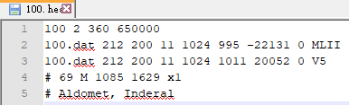
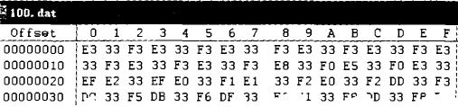
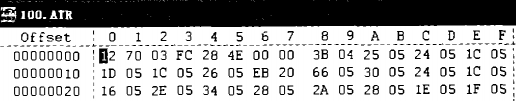
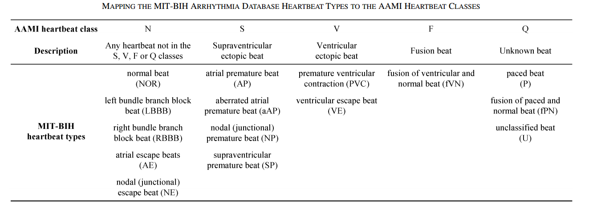

# Dataset
---
## MIT-BIH Arrhythmia Database
The database was the first generally available set of standard test material for evaluation of arrhythmia detectors, and has been used for that purpose as well as for basic research into cardiac dynamics at more than 500 sites worldwide. 

The MIT-BIH Arrhythmia Database contains 48 half-hour excerpts of two-channel ambulatory ECG recordings, obtained from 47 subjects studied by the BIH Arrhythmia Laboratory between 1975 and 1979. Twenty-three recordings were chosen at random from a set of 4000 24-hour ambulatory ECG recordings collected from a mixed population of inpatients (about 60%) and outpatients (about 40%) at Boston's Beth Israel Hospital; the remaining 25 recordings were selected from the same set to include less common but clinically significant arrhythmias that would not be well-represented in a small random sample.

The recordings were digitized at 360 samples per second per channel with 11-bit resolution over a 10 mV range. Two or more cardiologists independently annotated each record; disagreements were resolved to obtain the computer-readable reference annotations for each beat (approximately 110,000 annotations in all) included with the database.

Access the files
* MIT-BIH Arrhythmia Database is available on [physionet](https://www.physionet.org/content/mitdb/1.0.0/).
* [Download the ZIP file](https://www.physionet.org/static/published-projects/mitdb/mit-bih-arrhythmia-database-1.0.0.zip) (73.5 MB)
* Access the files using the Google Cloud Storage Browser [here](https://console.cloud.google.com/storage/browser/mitdb-1.0.0.physionet.org/). Login with a Google account is required.
* Access the files using the Google Cloud command line tools (please refer to the [gsutil](https://cloud.google.com/storage/docs/gsutil_install) documentation for guidance): `gsutil -m -u YOUR_PROJECT_ID cp -r gs://mitdb-1.0.0.physionet.org DESTINATION`
* Download the files using your terminal: `wget -r -N -c -np https://physionet.org/files/mitdb/1.0.0/`
* Access ECG data from [Kaggle](https://www.kaggle.com/datasets/mondejar/mitbih-database) in plain text format including raw signals in .csv files and original annotations in .txt & Structure .csv files & numberofsample, rawvaluesignal1, rawvaluesignal2

---
## mit-bih-arrhythmia-database-1.0.0
This folder is the original data set of MIT-BIH database. The database includes more than 4,000 24-hour periodic dynamic ECG data of 47 tested individual units, and there are 48 recording files with a duration of about 30 minutes, totaling 109,500 heart beats, of which abnormal heart beats account for about 30%. There are three types of ECG files in MIT-BIH database.

**(1) Header file (.hea)**

The information in the header file of the record file includes the related attribute information of all data of each record. Including sampling frequency, pilot number, data format, resolution, ADC, age, etc.

The first line contains two signals with a sampling rate of 360Hz, and the length of each signal is 650,000 sampling points.

The following two lines are the signal technical specification lines, from which it can be seen that both signals are contained in the file format 100.dat, and each signal is stored in a 12-bit compressed format. The gain of both signals is every 200ADC units/mV, the resolution of ADC is 11 bits, and the zero value of ADC is 1024. The values of the first sampling points of the two signals are 995 and 10,116,500, respectively. The verification numbers of the sampling points are -22131 and 20052, respectively. The input and output can be executed in blocks of any size, because the file content indicates that the values of the two signals are all 0, and the signal description field indicates that the two signals are taken from MLII lead and V5 lead respectively.

The last two lines of the file contain comment strings, in which the first line states the patient's age and gender and recorded data, and the second line lists the patient's medication.




**(2) Data file (.dat)**

The data file adopts "Format212" data storage mode, and each data file has two leads of signal data.

The "212" format is a database record for two signals. The data of these two signals are stored alternately, and two data are stored every three bytes.

Take 100.dat as an example, every three bytes (24 bits) represent two values, the first group is "E3 33 F3", and the two values are 0x3E3 and 0x3F3, respectively, which are converted into decimal 995 and 1011, representing signal amplitudes of 4.975mV and 5.055mV, respectively. These two values are the first sampling points of the two signals, and so on.



**(3) Annotation file (.art)**

The annotation file contains the heartbeat type and R wave position marked by authoritative experts, which provides the basis for the following algorithms to verify its effectiveness.

There are two main formats: MIT format and AHA format. If the first byte of a file is not 0 or the second byte is equal to "**[**"(0x5b) or "**]**"(0x5d), the file is stored in MIT format, otherwise it is stored in AHA format.

Taking 100.atr as an example, it can be judged that the file is stored in MIT format from the fact that the first byte in the file is not 0. The 16-bit value 0x7012 is first read from the first byte, with the upper 6 bits being 0x1C (decimal 28) and the lower 10 bits being 0x12 (decimal 18). The type code is 28, which represents the rhythm change, and the occurrence time is 0.05 seconds (18/360 Hz); Then read out the following 16-bit value 0xFC03, the value of the upper 6 bits is 0x3F (decimal 63), the value of the lower 10 bits is 0x03 (decimal 3), and the type code is 63, which means that 3 bytes of auxiliary information are appended to the 16-bit value, and if the number of bytes is odd, a null value of one byte is appended, which is "28 4E00 00" in this example. Then, the 16-bit value 0x043B is read from the next byte, the value of the upper 6 bits is 1, and the value of the lower 10 bits is 0x3B (decimal 59). The type code 1 represents normal heartbeat, and the occurrence time is 0.214 seconds ((18+59)/360 Hz). All comments can be read by analogy. When the read 16-bit value is 0, it means the end of the file.

*Example*: Hexadecimal 0x7012 is converted into binary 0111 0000 0001 0010, and the top 6 bits of 0111 00 are padded with 0 to get 0001 1100, and then converted into hexadecimal 0x1C, which corresponds to decimal 1 * 16 1+12 * 16 0 = 16+12 = 28. The lower 10 bits 00 0001 0010 are filled with 0, then 0001 0010, and then the hexadecimal number is changed to 0x12, which corresponds to decimal 1 * 16 1+2 * 16 0 = 16+2 = 18.



**Symbol Table**
Symbol  |                     Meaning                       |Noting
--------|---------------------------------------------------|-----------------------------
·/N     |Normal beat                                        |正常心跳
L       |Left bundle branch block beat                      |左束支传导阻滞
R       |Right bundle branch block beat                     |右束支传导阻滞
A       |Atrial premature beat                              |房性早搏
a       |Aberrated atrial premature beat                    |异常房性早搏
J       |Nodal (junctional) premature beat                  |交界性早搏
S       |Supraventricular premature beat                    |室上性早搏
V       |Premature ventricular contraction                  |室性早搏
F       |Fusion of ventricular and normal beat              |心室搏动与正常搏动融合
[       |Start of ventricular flutter/fibrillation          |开始心室扑动/纤颤
!       |Ventricular flutter wave                           |心室颤振波
]       |End of ventricular flutter/fibrillation            |心室扑动/颤动结束
e       |Atrial escape beat                                 |房性逸搏
j       |Nodal (junctional) escape beat                     |交界性逸搏
E       |Ventricular escape beat                            |室性逸博
/       |Paced beat                                         |起博心跳
f       |Fusion of paced and normal beat                    |起搏融合心跳
x       |Non-conducted P-wave (blocked APB)                 |非传导P波（APB阻塞）
Q       |Unclassifiable beat                                |无法分类的心跳
|       |Isolated QRS-like artifact                         |独立的伪QRS波群
--------|Annotations appear below                           |注释出现beats注释的级别下方
AB      |Atrial bigeminy                                    |房性早搏二联律
AFIB    |Atrial fibrillation                                |房颤
AFL     |Atrial flutter                                     |心房震颤
B       |Ventricular bigeminy                               |室性二联
BII     |2° heart block                                     |2°心脏传导阻滞
IVR     |Idioventricular rhythm                             |室性节律
N       |Normal sinus rhythm                                |正常窦性心律
NOD     |Nodal (A-V junctional) rhythm                      |房室结交界性心律
P       |Paced rhythm                                       |起搏心律
PREX    |Pre-excitation (WPW)                               |
SBR     |Sinus bradycardia                                  |窦性心动过缓
SVTA    |Supraventricular tachyarrhythmia                   |室上性快速性心律失常
T       |Ventricular trigeminy                              |心室三叉神经
VFL     |Ventricular flutter                                |心室扑动
VT      |Ventricular tachycardia                            |室性心动过速
--------|Signal quality and comment annotations appear above|信号质量和注释出现在上方
qq      |The first character c/n indicates the quality of the upper signal (clean or noisy), and the second character indicates the lower signal |信号质量变化：第一个字符(c/n)表示较高信号的质量（干净或有噪声），第二个字符表示较低信号的质量
U       |Extreme noise or signal loss in both signals       |两种信号的极端噪声或信号丢失
M/MISSB |Missed beat                                        |漏掉的节拍
P/PSE   |Pause                                              |暂停
T/TS    |Tape slippage                                      |磁带打滑

**Tables of beats and rhythms**
These tables summarize the contents of the database. These tables duplicate some of the contents of the previous section, to which reference should be made for more details. The first two tables list the beat types and rhythms for each half-hour record in its entirety. 

The column headings for the beat tables show the AHA annotation codes (N, V, F, E, P, Q, and O) above the symbols used for the database annotations elsewhere in this directory. For a complete list of these symbols, as well as the abbreviations used as the column headings for the rhythm tables, see Symbols.

The beat tables show the number of beats of each type in each record. The rhythm tables show the total duration of each rhythm observed in each record in minutes and seconds (rounded to the nearest second).


[VIEW COMPLETE TABLE](https://www.physionet.org/physiobank/database/html/mitdbdir/tables.htm#allrhythms)


---
## 17 classes ECG signals 3600
Contributor : Paweł Pławiak;

The created database with ECG signals is described below.
1. The ECG signals contained 17 classes: normal sinus rhythm, pacemaker rhythm, and 15 types of cardiac dysfunctions (for each of which at least 10 signal fragments were collected).
2. All ECG signals were recorded at a sampling frequency of **360 [Hz]** and a gain of 200 [adu / mV].
3. For the analysis, **1000, 10-second (3600 samples)** fragments of the ECG signal (not overlapping) were randomly selected.
4. Only signals derived from one lead, the MLII, were used.
5. Data are in mat format (Matlab).

Access the files
* 17 classes ECG signals 10s based on MIT-BIH is available on [mendeley](https://data.mendeley.com/datasets/7dybx7wyfn/3).

Related Links 
* [Novel methodology of cardiac health recognition based on ECG signals and evolutionary-neural system](http://dx.doi.org/10.1016/j.eswa.2017.09.022)


---
## 5 classes QRS signals 130 -- MITBIH2QRS_5C130.py
Contributor : 吴中行;

Run ```python MITBIH2QRS_5C130.py``` first.

The created database with ECG signals is described below.
1. The ECG signals contained 5 classes: *F N Q S V* according to **AAMI EC57** standard.
2. All ECG signals were recorded at 130 samples on *QRS* wave.
3. Only signals derived from one lead, the MLII, were used.
4. Data are in .csv format.

**ANSL/AAMI EC57:2012** is a series of standards formulated by the American Association for the Advancement of Medical Instrumentation (AAMI), including the classification of arrhythmia, the evaluation standard of arrhythmia classification detection algorithm and so on.

AAMI stipulates that ECG beats can be divided into five categories:
- N (normal or bundle branch block beat)
- S (supraventricular abnormal beat)
- V (abnormal ventricular beat)
- F (Fusion Beat)
- Q (beat that cannot be classified)
- The unreadable U-type, the auxiliary unreadable sign X-type and O-type.

AAMI also specifies the evaluation criteria of arrhythmia classification and detection algorithms, including the calculation method of algorithm accuracy (confusion matrix), and the accuracy (ACC), sensitivity (SEN), true positive rate (PPR) as parameters to measure the classification performance of the classifier. Each parameter is calculated by confusion matrix.

AAMI standard points out that **the accuracy of Q classification is for reference only, while U, X and O are not real ECG beats**. Therefore, the final accuracy of classification algorithm is ACC, SEN and PPR of N, S, V and F ECG beats.

MIT-BIH database *VS* ANSL/AAMI EC57:2012

See more in *[AAMI EC57-2012 Testing and reporting performance results of cardiac rhythm and ST segment measurement.pdf](./AAMI%20EC57-2012%20Testing%20and%20reporting%20performance%20results%20of%20cardiac%20rhythm%20and%20ST%20segment%20measurement.pdf)*


---
## 5 classes ECG signals 3600 -- MITBIH2ECG_5C14C3600.py
Contributor : 吴中行;

Run ```python MITBIH2ECG_5C14C3600.py``` first.

The created database with ECG signals is described below.
1. The ECG signals contained 5 classes: *F N Q S V* according to **AAMI EC57** standard.
2. All ECG signals were recorded at 3600 samples in 10s with 360Hz frequency.
3. Only signals derived from one lead, the MLII, were used.
4. Data are in .npy format.


---
## 5 classes ECG signals 128x128 -- MITBIH2ECG_5C128x128.py
Contributor : 吴中行;

Run ```python MITBIH2ECG_5C128x128.py``` first.

The created database with ECG signals is described below.
1. The ECG signals contained 5 classes: *F N Q S V* according to **AAMI EC57** standard.
2. All ECG signals were recorded as 128x128 *grey img* of *QRS* wave.
3. Only signals derived from one lead, the MLII, were used.
4. Data are in .npy format.
